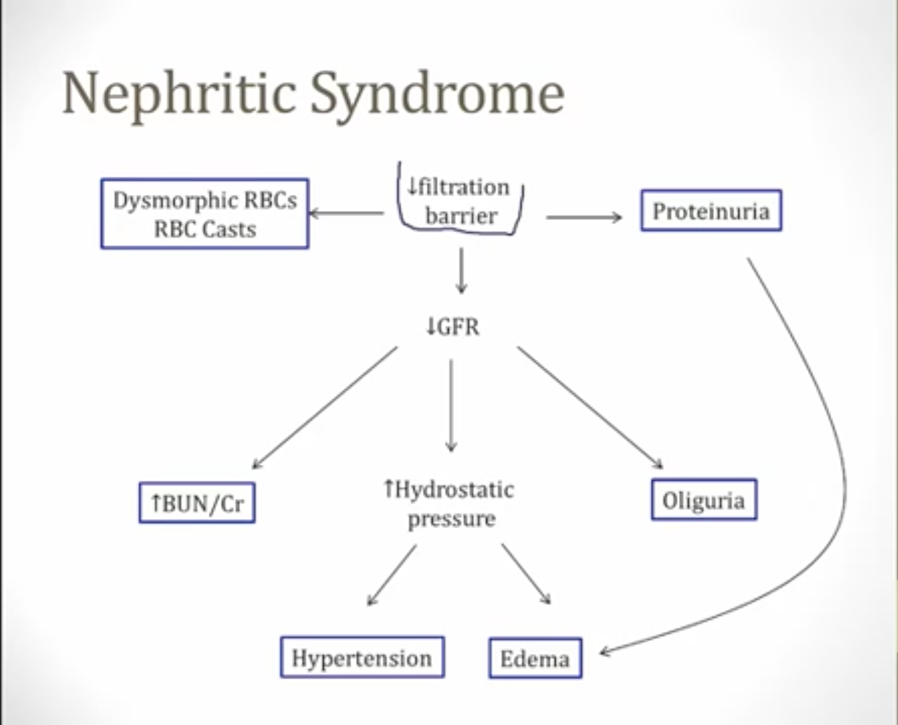

# Glomerular Diseases
Normally, the glomerulus whats to allow filteration of water, electrolytes, glucose, and amino acids into the Bowman's space. Importantly, it wasts to prevent filteration of most proteins and red blood cells. Thus, glomerular pathologies involve proteinuria or hematuria. To reach the Bowman's capsule, filtrates must cross the glomerular filteration barrier, which includes:

1. Capillary endothelium
	- fenestrated (has holes) that allow for 40 nm molecules to pass through
	- repels red cells, white cells, and platlets
	- first barrier to filteration 
	- essentially keeps out all cells
2. Basement membrane
	- made of negatively charged type IV collagen and heparan sulfate
	- repels negatively charged molecules like albumin and is a 4 nm size barrier
3. Podocytes (epithelium)
	- have processes that wrap around capillaries
	- the space between the processes filter blood for particples smaller than 4 nm

All glomerular diseases are caused by the breakdown of the filteration barrier at some level. The major difference between nephritic and nephrotic syndromes it the site of glomerular damage.

## Hematuria
Hematuria is the presence of RBCs in urine. This is detected by urinalysis via either a dipstick (heme's peroxidase reacts with the strip) of microscopy (the cells are visualized). The dipstick can also be present in rhabdomyolysis, or the presence of myoglobin in the urine. 

Hematuria can have many causes. It can be gross (abnormal urine color) or microscopic (only found via urinalysis). It can occur naturally after exercise but common causes include:
* UTI's
* Kidney Stones

The most feared cause is bladder cancer, but glomerular disease is a rare cause. Patients with glomerular disease will also present with <b>red cell casts</b> and protein in the urine. Red cell cases are caused when RBCs are pushed into the nephron, which leads to them bunching up and causing "casts". For the same reason, glomerular bleeding can cause dysmorphic RBCs, acanthocytes (RBCs with spiked cell membrane), "coca cola" colored urine, and generally do not present with clots. 

## Proteinuria
Protein (primarily albumin) in the urine is also detected via the dipstick. This can be biased by urine concentration. To account for this, you can take the protein:creatinine ratio from the 1st or 2nd morning sample of urine after avoiding exercise. The best way is to do a 24-hour urine collection. 

## Nephrotic Syndromes
Filteration barrier to proteins is lost but the RBCs are still filtered (i.e. capillary endothelium is still intact). This leads to massive proteinuria. In general, this happens during injury to podocytes, which leads to <b>only</b> protein loss (due to other filteration barrier), indicating a nephrotic syndrome. 

## Nephritic Syndromes
Urinary lipids may be present and are trapped in casts (called fatty casts). Under polarized light, the fat droplets look like the maltese cross. General symptoms include:
- frothy urine
- ankle swelling
- periorbital swelling
- high cholesterol (> 300)
- proteinuria

This is caused by inflmmation that damages the entire glomerulus. The filteration to both RBCs and proteins is lost, and the glomerular damage leads to a decrease in the filteration rate. Destruction causes RBCs in the urine and RBC casts. The protein in the urine presents less than that in nephrotic syndrome because there is lower glomerular filteration. 

In summary, due to a loss of the filteration barrier, nephritic syndromes decrease the GFR causing:
- an increase in hydrostatic pressure, which causes
	- hypertension
	- edema
- an increase in BUN and Cr
- oliguria (low urine output)  
Additionally, nephritic syndromes lead to:
- dysmorphic RBCs and RBC casts
- (mild) proteinuria 

Clasically, nephritic syndromes can be diagnosed via:
- dark urine
- swelling
- fatigue
- (mild) proteinuria 

Injury to endothelial and mesangial cells allows them to be exposed to blood, which leads to inflammation (nephritis) and loss of RBCs and protein via urine. 

### Post-Streptococcal Nephritis 
Follows a group A beta-hemolytic strep infection. Patients after strep either develop rheumatic fever or P-SGN. This is due to nephritogenic strains of strep, which carry a specific subtype of M protein virulence factors that leads to GN. 

P-SGN causes immune complex depoits in the kidney. Antigens fix compliment in the kidney and cause inflammation via PMNs. The inflammation depletes plasma complement factor.

P-SGN is common in children but can occur in adults. Classically occurs in children 2-3 weeks (time to immune complex formation) following a strep throat infection. 

On light microscopy, the glomeruli are enlarged and hypercellular. Anti-bodies build up in the subendothelial layer. There are also subepithelial humps on electron microscopy. These are immune complexes that have worked their way into the subepithelial layer. 

95% of children completely recover, while only 60% of adults completely recover. Many develop renal insufficiency up to 10 to 40 years after the initial illness. They can also develop RPGN following P-SGN. 

Therapy for P-SGN is supportive and patients who recover do so spontaneously (with time). 

### Berger's (IgA) Nephropathy
Most common form of GN worldwide and presents with repeated episodes of hematuria. Over time, IgA GN leads to ESRD and HD in 50% of patients. This is driven due to an increase in IgA synthesis in response to certain triggers, such as respiratory or GI infections, as IgA is a mucousal antibody. This leads to increased IgA complexes that deposit in the mesangium, which triggers inflammation in the glomeruli. In IgA GN, there is an activation of complement (while there usually is not) via the leptin and alternative pathways; however, there is no hypocomplementemia due to mild activation. The end result is glomerular injury and inflammation.

A classic case presents with recurrent episodes of hematuria since childhood following URI or diarrheal illness. There is slowly worsening renal function, leading to increases in BUN and Cr over time and a possible progression into ESRD or HD. IgA GN occurs in just *days* after an infection, as opposed to weeks in P-SGN.

### Diffuse Proliferative Glomerulonephritis
GPGN is the most common systemic lupus erythematosus (SLE) renal disease; it is also known as Type IV Lupus Nephritis. It often presents with fever, rash, and arthritis. Immune complex deposition in the glomeruli leads to inflammation. Type III Lupus Nephritis is "focal" PGN and involves less than 50% of the glomeruli. Proliferative refers to the increase in glomeruli cellularity.

Subendothelial deposits drive the immune response. This leads to hypocomplementemia via anti-dsDNA antibodies. Classicially, this presents with thickened capillary loops. There are other mixed clinical presentations, including:
* Proteinuria (sometimes nephrotic)
* hematuria
* reduced GFR
* progression into ESRD and HD (sometimes) 

### Rapidly Progressive Glomerulonephritis
RPGN is called "crescentic" GN, due to the presence of crescents in the glomeruli formed by inflammation. Many diseases can lead to this condition, but there is a rapid onset coupled with progressive loss of renal function. The rapid onset leads to acute renaal failure, fatigue, and anorexia.

There are 3 categories split by the pattern of immunofluorescence:
1. Type I: Linear IF
2. Type II: Granular IF
3. Type III: Negative IF

### Alport Syndrome
Aplort syndrome caused by a type IV collagen defect driven by mutations in the alpha-{3, 4, 5} chains found in the basement membranes of kidneys, eyes, and ears. It is an inherited X-linked disease which commonly presents with a triad:
1. hematuria
2. hearing loss
3. ocular disturbances 

### Membranoproliferative Flomerulonephritis

# Urinary Infections
There are two main types of UTI's: 
1. cyctitis
	- infection of the bladder
	- lower UTI
2. pyelonephritis
	- infection of the kidneys
	- upper UTI 

Most infectious bacteria "ascend," meaning they travel from the urethra into the bladder (cystitis) and finally into the kidney (pyelonephritis). E. coli causes 75-95% of all UTIs. Others include
* proteus mirabilis
	- urease producing bacteria
	- produces kidney stones
* Klebisiella pneumoniae
* Staphylococcus saprophyticus
* Enterococcus faecalis

Diagnosis of UTIs is most comonly done via a urinalysis. Urine from the sample will appear cloudy and present with leukocyte esterase (which is produced by the WBCs in the urine); if the WBC count is high, this is also indicative of a UTI. Additionally, nitrates will be present in 90% of UTIs, depending on the specific bug. The most definitive test is via a urinary culture. 

Women are 10X more likely to get UTIs then men due to their shorter urethra and the proximity to fecal flora via the rectum. Sexual activity (in women), urinary catherterization, diabetes, and pregnancy all increase risk of UTIs. A slow urinary flow will also allow bacteria to climb the urethra more easily, increasing UTI risk. Slow urine flow is found in:
* infants with vesicouretral reflux
	- ureters insert abnormally into the bladder causing chronic reflux of urine back into the ureters
* patients with urinary obstruction
	- this can be anatomic abnormalities (children), bladder tumors (adults), or enlarged prostates (elderly)

Treatment is via fluoroquinolones (i.e. ciprofloxacin, levofloxacin, ofloxacin). A 3-day course will clear the UTI. In pregnant women, nitrofurantoin is often used. TPM-SMX was used before fluoroquinolones. 

## Sterile Pyuria
Some women with chlamydia or gonorrhea present with UTI symptoms. Urinalysis generally shows pyuria but no bacterial growth. The majority of women are asymptomatic. 

## Cystitis
Symptoms of cystitis include:
* dysuria (pain with urination; often a burning pain)
* frequent and urgent urination
* suprapubic pain
* no systemic symptoms (e.g. fevers, chills, sweats) and a normal WBC 

## Pyelonephritis
Symptoms include:
* systemic symptons present
* flank pain
* CVA tenderness (kidney area)
* hematuria 
* WBC casts 

### Chronic Pyelonephritis
This happens with repeated pyelonephritis (which may occur to due a vesicoureteral reflux in children or recurrent kidney stones). This causes scarring of the corticomedullary region of the kidneys and blunted calycies. There is also thyroidization of the kidneys. 

# Cystic Kidney Disease

# Diuretics

# Kidney Stones
Kidney stones generally present with:
* flank pain that waxes and wanes in severity
* hematuria

Common risk factors for kidney stones include:
1. High stone forming substances in blood
	- Hypercalcemia
	- Hyperuricemia
2. Low urine volume: increases concentration of urine substances
	- Dehydration

In general, hydration lowers the risk for stones. 

## Ca Stones
Calcium oxalate is the most common type of calcium stone, with calcium phosphate making up the rest. Caclium stones are radiopaque and can thus be seen on an x-ray or CT-scan. Calcium stones account for 80% of all kidney stones and are driven primarily by:
1. hypercalcemia
2. high oxalate levels in the blood

The most common etiology is idiopathic hypercalciuria but do not present with hypercalcemia. Other patients have hypercalcemia driven by hyperparathyroidism. Other risk factors include:
* high oxalate levels (such as in Crohn's disease or gastric bypass patients)
* ingestion of ethylene glycol (antifreeze)
* Vitamin C abuse 
* Dietary sodium
	- Na increases ECV (in order to maintain the ECV:Na ratio), which leads to reduction in the RAAS and subsequent decrease in Na reabsorption in the PCT. 
	- Na and Ca reabsorption are coupled in the PCT, leading to decreased Ca reaborption. 

Treatment generally involes natural passing of the stones. Large stones require surgery. Recurrent stone formers may have to take medication including thiazide diuretics (which decrease the secretion of Ca into the urine) or citrate (which binds with calcium to keep it dissolved in urine).  

## Struvite Stones
These are stones made up of NH4-Mg-PO3 and account for 15% of stones. They are usually consequences of UTIs do the hydrolyzation of urea into ammonia. Struvite stones form "staghorn calculi" seen on CT or x-ray which is a cast in the renal pelvis and calicies. These won't pass and require surgery. Left untreated this can be a good place for bacteria to grow leading to recurrent UTIs. 

## Urate Stones
When H+ reactes with urate to form uric acid, this can lead to radiolucent stones. The lowest pH is in the DCT, so this is where these form. Risk factors include:
* high uric acid levels	
	- gout
	- leukemia
* acidic urine
	-chronic diarrhea
* hot, arid climates 

Treatment generally involves hydration and alkalization of urine with potassium bicarbonate. Surgery is not usually required. 

## Cystine Stones
Cystine stones are rare and seen in children with cystinuria, which is caused by inability to absorb cystine. These stones also form staghorn calculi. 

# Renal and Bladder Tumors

# Rhabdomyolysis